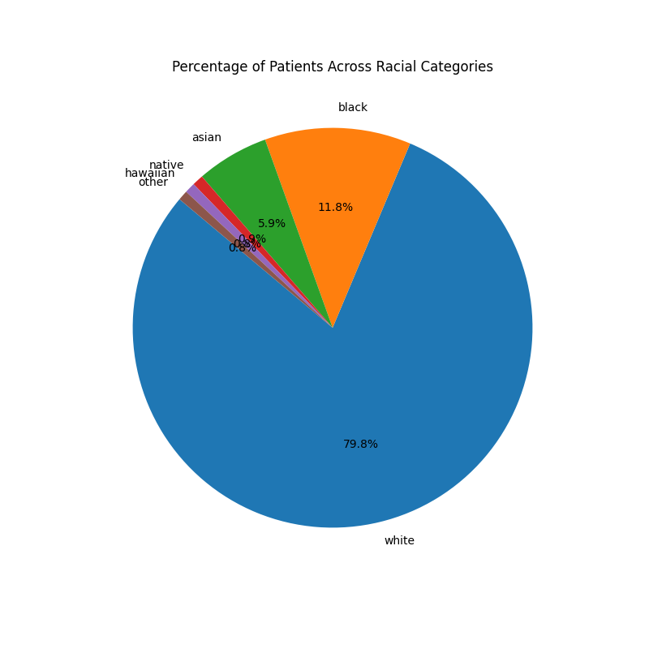
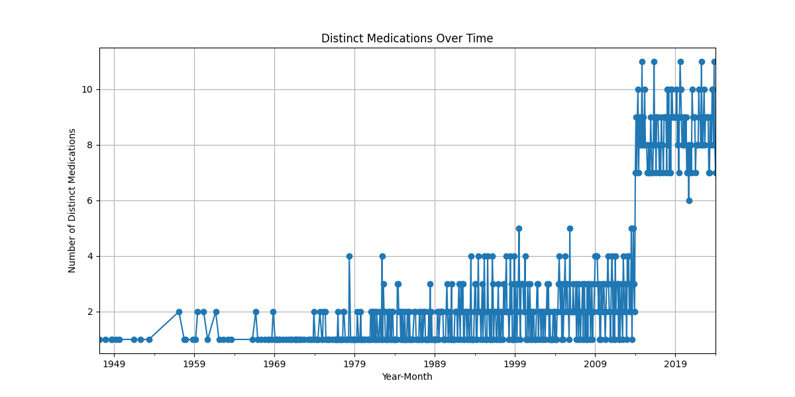
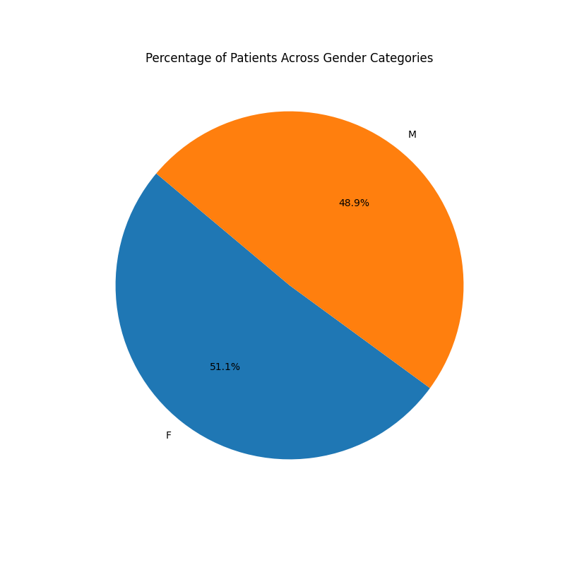

# Century Health Data Engineering Task

## Overview

This repository contains the implementation of a data engineering task for Century Health. The task involves understanding raw healthcare data, identifying data quality issues, applying a standardization framework, and building a data pipeline. The pipeline processes and merges various datasets related to Lupus patients in Texas and performs several analyses on the cleaned data.


## Datasets

The datasets used in this project are as follows:

- **Patients**: Patient demographics including birth date, name, race, ethnicity, gender, location, and income.
- **Encounters**: Visit-level information, including visit description, diagnosis code, and cost.
- **Symptoms**: Lab results, specifically symptoms taken for Lupus patients, such as Rash, Joint Pain, Fatigue, and Fever.
- **Medications**: Medication information, including therapeutic code, description, reason, and cost.
- **Conditions**: Condition of patient in encounter, including diagnosis code and description.
- **Patient Gender**: Gender information for the patients.

## Data Pipeline

The data pipeline is built using the Kedro framework and consists of the following steps:

1. **Connect**: Load the datasets.
2. **Clean**: Fix data quality issues, standardize fields, and add missing data.
3. **Structure**: Standardize column names and extract individual symptoms.
4. **Merge**: Join the datasets to create a master table.
5. **Save**: Save the merged data into a SQLite database.

## Setup

### Prerequisites

- Python 3.8 or above
- Kedro
- SQLite
- Great Expectations
- dbt


## Installation

1. **Clone the repository**:

   ```sh
   git clone https://github.com/26nikhilkumar/healthcare-pipeline.git
   cd healthcare_pipeline
2. **Create and activate a virtual environment:**
    ```
    python -m venv venv
    source venv/bin/activate  # On Windows use `venv\Scripts\activate`
3. **Install the dependencies:**
    ```
    pip install -r requirements.txt
    ```

## Running the Pipeline

### Data Processing Pipeline

To run the data processing pipeline, which loads, cleans, structures, merges, and saves the data:

```sh
kedro run --pipeline data_processing
```
### Data Analysis Pipeline

To run the data analysis pipeline, which loads the data from the SQLite database and performs various analyses:
```sh
kedro run --pipeline data_analysis
```

## Data Analysis

The following analyses are performed in the data analysis pipeline:

1. Count Distinct Patients: Calculates the number of distinct patients in the dataset.
2. Plot Distinct Medications Over Time: Plots the distinct medications over time.
3. Plot Racial and Gender Distribution: Creates pie charts indicating the percentage of patients across each racial category and gender.
4. Calculate Percentage of Patients with Symptoms: Calculates the percentage of patients with all 4 symptom categories ≥ 30.

### Some analysis results are:

```Number of distinct patients: 10000```

```Percentage of patients with 4 or more symptoms: 8.72%```








## dbt and Great Expectations

## Running dbt

To run the dbt pipeline manually:

Navigate to the dbt directory:

```sh
cd healthcare_pipeline_dbt/
```

```
dbt clean
dbt deps
dbt seed
dbt run
dbt test
```
## Running Great Expectations

To run Great Expectations manually:

Navigate to the Great Expectations directory:
```sh
cd gx/validations/
```
```
./validate_all.sh
```

## Conclusion

This project demonstrates the process of loading, cleaning, structuring, merging, and analyzing healthcare data using Kedro. The pipeline is designed to be modular and easy to understand, making it easy to extend or modify for future tasks.

For any questions or further information, please contact `Nikhil Kumar` at `26nikhilkumar01@gmail.com`.